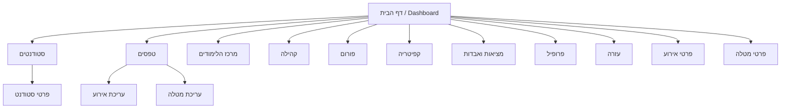

## Wireframe / תרשים אתר פשוט

המסמך מציג תרשים ניווט בסיסי (Sitemap) ומבני עמודים מרכזיים כ־Wireframe.

### Sitemap (Mermaid)


### תבנית פריסת עמוד כללית
```
┌───────────────────────────────────────────────┐
│ Header: לוגו | ניווט עליון | התחברות/התנתקות │
├───────────────────────────────────────────────┤
│ Main Container (maxWidth=xl)                  │
│  └─ תוכן הדף (גרידים / כרטיסים / טפסים)      │
├───────────────────────────────────────────────┤
│ Footer: קישורים / זכויות יוצרים              │
└───────────────────────────────────────────────┘
```

### דף הבית (Dashboard)
```
┌───────────────────────────────────────────────┐
│ WelcomeBanner                                 │
├───────────────────────────────────────────────┤
│ Grid 3x:                                      │
│  ├─ EventsCard  ├─ TasksCard  ├─ FacilitiesCard│
└───────────────────────────────────────────────┘
```

### סטודנטים (`/students`)
```
┌───────────────────────────────────────────────┐
│ כותרת + פילטרים (חיפוש/סינון)                │
├───────────────────────────────────────────────┤
│ StudentsTable (טבלה עם עמודות ומחוות פעולה)   │
└───────────────────────────────────────────────┘
```

### פרטי סטודנט (`/students/:id`)
```
┌───────────────────────────────────────────────┐
│ כותרת + פרטי בסיס (שם, מחלקה, דוא"ל)         │
├───────────────────────────────────────────────┤
│ כרטיסי מידע:                                  │
│  ├─ ציונים / סטטוס                           │
│  ├─ מטלות פתוחות                             │
│  └─ הערות/תקשורת                             │
└───────────────────────────────────────────────┘
```

### טפסים (`/forms`)
```
┌───────────────────────────────────────────────┐
│ Tabs: אירועים | מטלות                         │
├───────────────────────────────────────────────┤
│ Grid / רשימות לניהול פריטים                  │
│  └─ פעולה: יצירה / עריכה / מחיקה             │
└───────────────────────────────────────────────┘
```

### מרכז הלימודים (`/learning`)
```
┌───────────────────────────────────────────────┐
│ סיכום קורסים / ציונים / תרשימים              │
├───────────────────────────────────────────────┤
│ רשימות מטלות לפי קורס                         │
└───────────────────────────────────────────────┘
```

### קהילה (`/community`)
```
┌───────────────────────────────────────────────┐
│ כותרת + FacilitiesCard                        │
├───────────────────────────────────────────────┤
│ טופס פניה: קטגוריה | תיאור | תאריך | מיקום     │
│  └─ כפתורים: שליחה | ניקוי                        │
└───────────────────────────────────────────────┘
```

### פורום (`/forum`)
```
┌───────────────────────────────────────────────┐
│ רשימת שרשורים / חיפוש                         │
├───────────────────────────────────────────────┤
│ תוכן שרשור נבחר + תגובות                      │
└───────────────────────────────────────────────┘
```

### קפיטריה (`/cafeteria`)
```
┌───────────────────────────────────────────────┐
│ כותרת + תיאור                                 │
├───────────────────────────────────────────────┤
│ Grid גלריה (תמונות תפריטים)                   │
└───────────────────────────────────────────────┘
```

### מציאות ואבדות (`/lost-found`)
```
┌───────────────────────────────────────────────┐
│ טופס דיווח + רשימת פריטים אחרונים            │
└───────────────────────────────────────────────┘
```

### פרופיל (`/profile`)
```
┌───────────────────────────────────────────────┐
│ פרטי משתמש + פעולות עדכון                    │
└───────────────────────────────────────────────┘
```

### עזרה (`/help`)
```
┌───────────────────────────────────────────────┐
│ FAQ Accordion + קופסת מידע על העוזר           │
│  └─ קישור/הדגשה לעוזר הווירטואלי             │
└───────────────────────────────────────────────┘
```

הערות:
- התרשים מייצג Wireframe ל־UI בלבד ולא את הלוגיקה.
- ניתן להרחיב לפי צורך (לדוגמה: מצבי טעינה Skeleton, התראות, מצבי ריקון נתונים).


